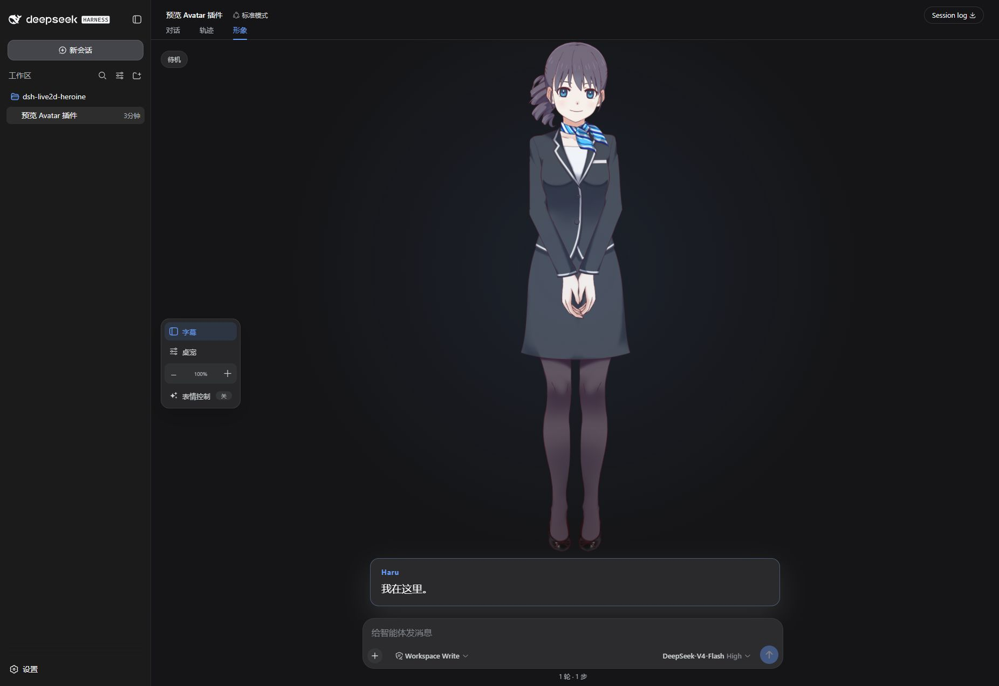
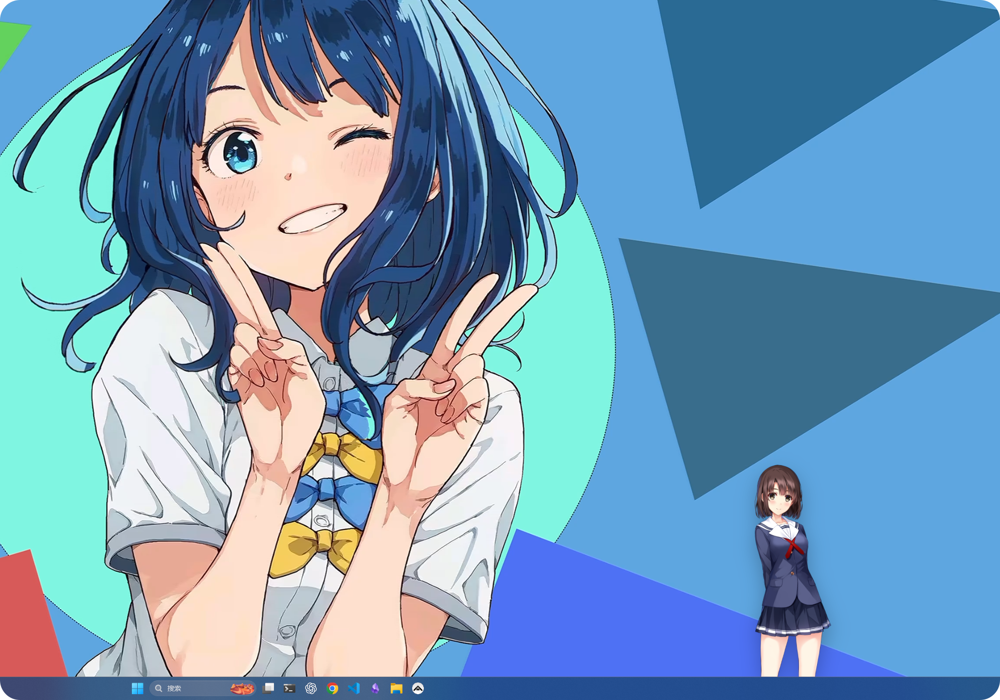
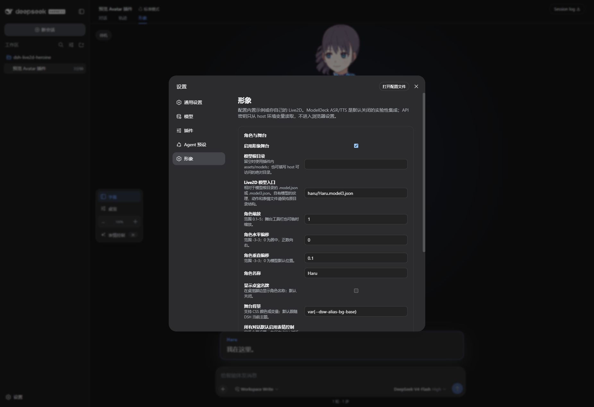
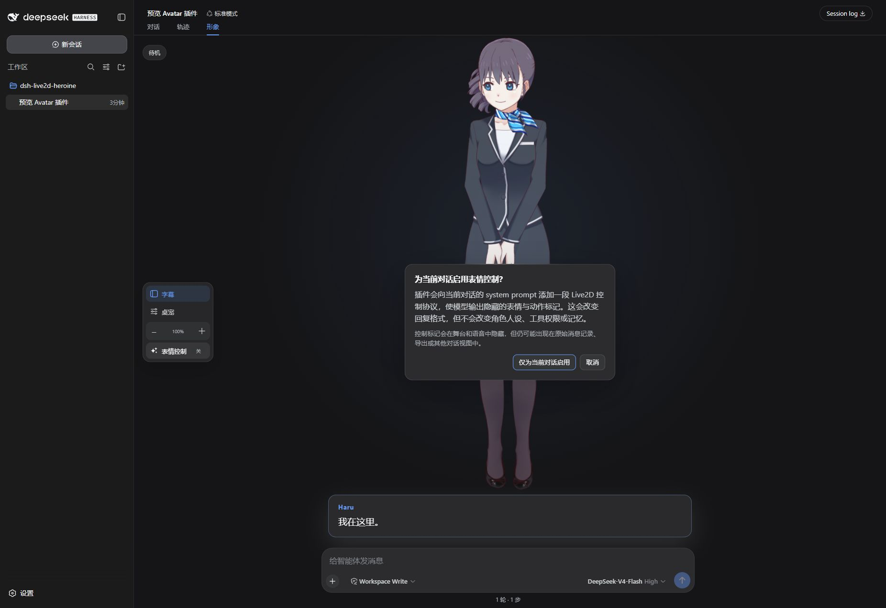

# dsh-live2d-avatar


`dsh-live2d-avatar` 为 DeepSeek Harness（DSH）提供可切换的 Live2D 对话舞台、轨迹展示和桌宠模式。它不替代 DSH 的对话、Agent、记忆、工具或历史记录，只负责角色的视觉表现和可选的语音交互。

## 功能概览

- 对话、轨迹、形象三个视图；形象视图提供 Live2D 舞台
- 内置可公开使用的 Live2D Haru 示例模型，安装后即可看到效果
- 支持用户导入自己的 Cubism 2/3+ 模型，并设置模型目录、缩放和位置
- 普通 DSH Web 中提供可拖动的页面内桌宠
- TokensCowork Desktop 中可打开透明、置顶、独立的桌宠窗口
- 可选的表情控制 prompt；首次安装默认关闭，并支持按当前对话授权
- ASR/TTS 默认关闭，不影响没有语音服务的用户使用视觉功能



## 安装

可以让 DSH Agent 执行：

```text
请帮我安装 dsh-live2d-avatar 插件，并确认安装后可以打开“形象”视图。
```

也可以手动安装：

```sh
dsh plugin --profile web add dsh-live2d-avatar
dsh web
```

打开一个非空对话后，选择“形象”即可看到内置 Haru。卸载：

```sh
dsh plugin --profile web remove dsh-live2d-avatar
```

## 桌宠模式

在普通 `dsh web` 中，桌宠会显示为页面内的可拖动浮层。在 TokensCowork Desktop 中，插件可以创建透明、无边框、置顶的独立窗口，因此主窗口最小化或被其他应用遮挡时，角色仍可显示在 Windows 桌面上。



独立窗口仍依赖正在运行的 TokensCowork Desktop；退出客户端后桌宠也会关闭。桌宠和舞台会使用当前形象设置，包括模型、角色名、缩放和位置。

## 使用自己的 Live2D 模型

在“形象”设置中可以配置：

- 模型目录：包含模型及其纹理、表情、物理和动作文件的目录
- 模型入口：相对于模型目录的 `.model.json` 或 `.model3.json` 文件
- 缩放、X/Y 偏移：用于调整舞台和桌宠中的显示大小与位置

也可以把模型目录放在插件的 `assets/models/<名称>/` 下。由于模型目录会由本机 DSH 服务提供给浏览器，请只选择专用模型目录，不要选择包含隐私文件的宽泛目录。



未知模型会使用通用 profile；基础渲染、口型同步和模型自带的点击动作仍可工作。更细致的表情到动作映射属于后续版本，不影响第一版使用自定义模型。

内置 Haru 使用 Live2D 的 Free Material License，具体授权请阅读 [`assets/models/haru/NOTICE.md`](assets/models/haru/NOTICE.md)。Haru 的授权不包含在本项目 MIT 许可证中。

## 表情控制 prompt

表情控制 prompt 会让当前对话中的 LLM 在台词前输出 Live2D 表情和动作指令。它可能改变发送给模型的 prompt，因此属于可选且具有侵入性的功能：

- 首次安装默认关闭，不会自动修改任何对话
- 启用前会在当前对话中明确提示并请求授权
- 可以在设置中配置全局默认，但单个对话仍可覆盖
- 控制标记不会显示在台词或发送到 TTS



## ASR 与 TTS（可选）

第一版不要求所有用户都能使用语音功能。ASR 和 TTS 默认关闭，视觉舞台、模型和桌宠不依赖语音服务。

启用后，可以填写自己部署的 ASR/TTS HTTP API 地址。当前实现优先兼容 ModelDeck 使用的接口格式；其他服务和渠道会在后续版本逐步支持，也欢迎通过 Issue 提出需求。录音只会发送到用户配置的 ASR 地址，回复文本只会发送到用户配置的 TTS 地址。

API 密钥不会填写到浏览器设置中，只支持从 DSH host 的环境变量读取。请仅配置自己信任的 `http(s)` 地址，并注意语音数据和文本会离开本机发送到该服务。

## 安全与隐私

- 默认安装不会请求 ASR/TTS 服务，也不会注入表情控制 prompt
- prompt 控制按对话授权，且可以随时关闭
- API 密钥只从 host 环境变量读取，不进入浏览器配置或日志
- 模型文件仅应放在专用目录中，避免意外暴露其他本地文件
- 语音服务为用户自部署或自行信任的服务，插件不代替用户判断其隐私策略
- Desktop 桌宠是可选增强；没有 Electron 时会自动退回页面内桌宠

## 开发

```sh
pnpm install
pnpm check
pnpm build
pnpm test
pnpm watch
```

本地安装到 DSH Web profile：

```sh
dsh plugin --profile web add link:C:\path\to\dsh-live2d-heroine
dsh --profile web
```

发布前检查项见 [`docs/release-checklist.md`](docs/release-checklist.md)。

## 许可证与示例素材

插件代码使用 MIT 许可证，见 [`LICENSE`](LICENSE)。内置 Haru 示例素材由 Live2D Inc. 提供并受其单独授权条款约束；请同时阅读 [`NOTICE.md`](assets/models/haru/NOTICE.md) 以及 [Live2D Free Material License](https://www.live2d.com/eula/live2d-free-material-license-agreement_en.html)。
